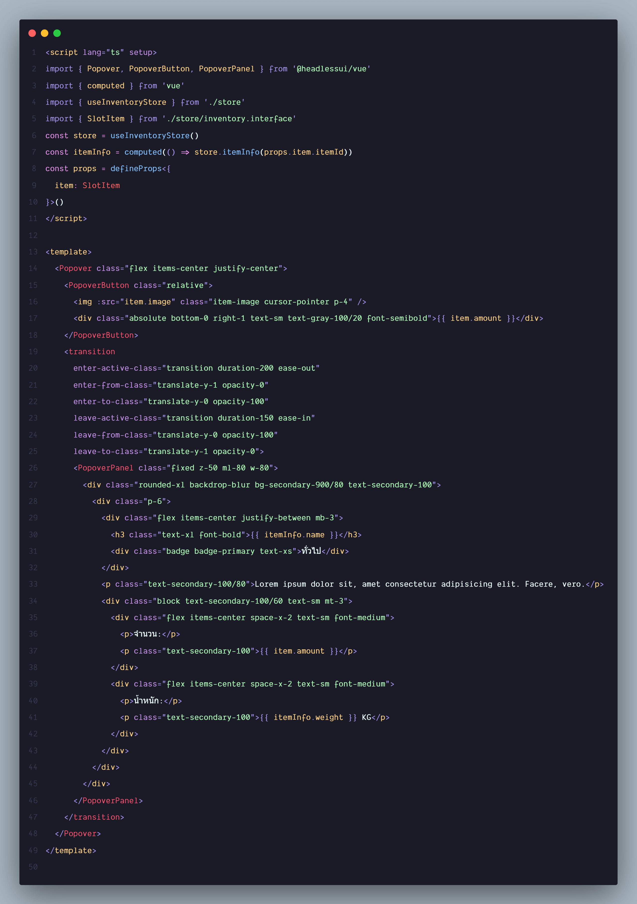
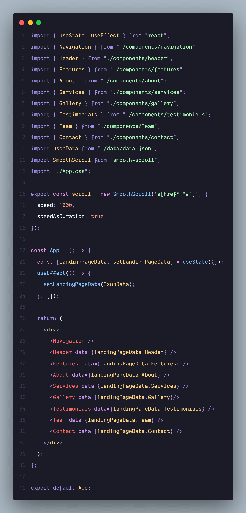
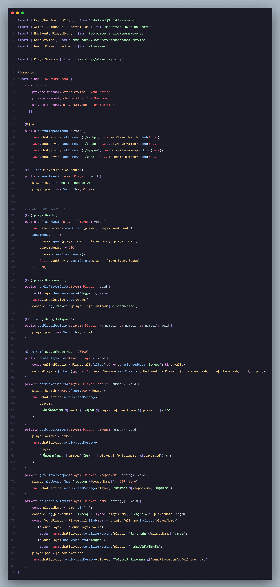
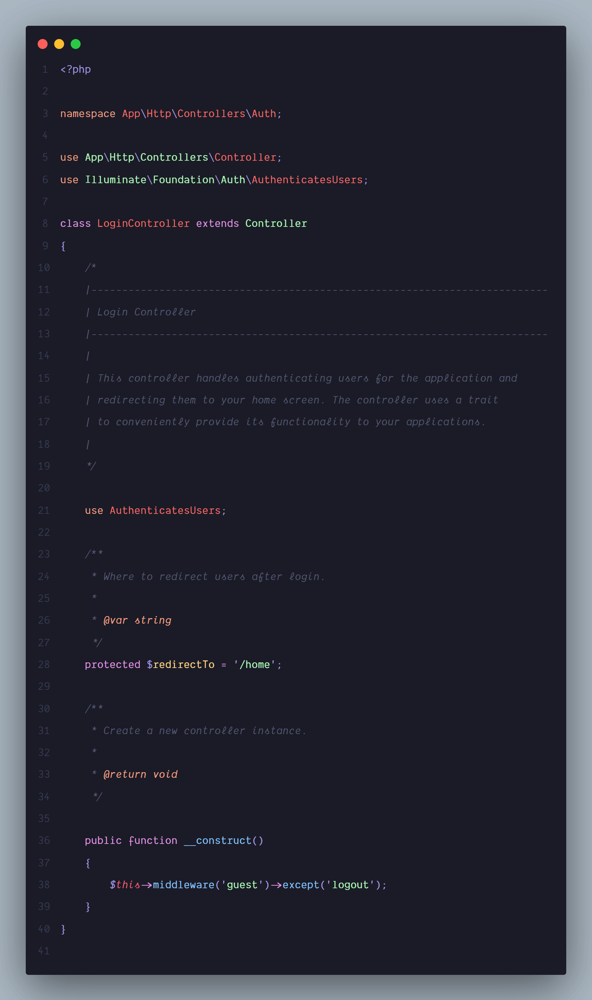
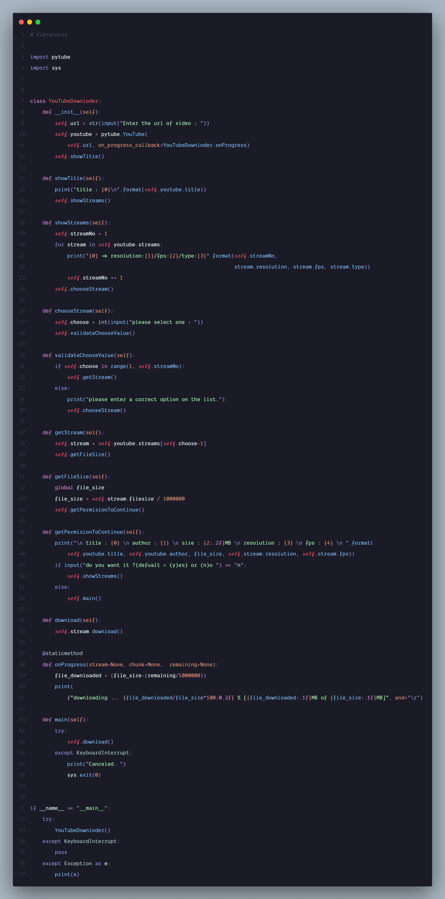

# Sabye Theme
Sabye(สบาย, sa-bye) is a thai word meaning comfortable. this theme make for take care developer eyes.🏝️

> Recommended: [italicc](https://marketplace.visualstudio.com/items?itemName=izcream.italicc) toggle italic extension for on/off italic text on your editor😎

### Screenshot

font use in screenshort is Dank mono my all time favorite font😍

made with ❤️ by [izcream*](https://github.com/izcream)

credit: [moon-ui](https://github.com/g3offrey/moon-ui)
